# 🎓 EduPulse | London A/L & O/L Academy LMS

EduPulse is a unified, multi-role Learning Management System (LMS) designed for London GCE Advanced Level (A/L) and Ordinary Level (O/L) education (Pearson Edexcel & Cambridge International specifications). It integrates student learning portals, faculty instruction studios, and administrative command consoles.

---

## 👥 User Roles & Core Capabilities

| Role | Access URL | Core Capabilities |
| :--- | :--- | :--- |
| **🎓 Student** | `/dashboard` | Enrolls in syllabus courses, accesses lesson modules & study guides, joins live classes, manages personal calendar, uploads private study files, and chats with faculty tutors. |
| **👨‍🏫 Faculty Instructor** | `/tutor` | Schedules and launches live interactive masterclasses, manages syllabus content, reviews enrolled student rosters, conducts 1-on-1 consultations, and communicates with students. |
| **🛡️ System Administrator** | `/admin` | Curates courses and syllabus units, assigns faculty, manages user accounts and roles, monitors live classes, and oversees platform analytics & honors clearances. |

---

## 📊 Full System Use Case Diagram

```mermaid
flowchart TB
    %% Actors
    subgraph Actors [System Actors]
        Student["🎓 Student"]
        Instructor["👨‍🏫 Faculty Instructor"]
        Admin["🛡️ System Admin"]
    end

    %% System Boundary
    subgraph SystemBoundary ["EduPulse LMS Platform"]
        
        %% Authentication & Profile
        subgraph AuthModule ["🔐 Authentication & Profile Management"]
            UC_Auth(["Sign In / Sign Up / Password Reset"])
            UC_Profile(["Manage Academic Profile & Credentials"])
            UC_Notif(["Receive Real-Time Notifications"])
            UC_Chat(["Direct Academic Messaging"])
        end

        %% Student Use Cases
        subgraph StudentModule ["🎓 Student Learning & Activities"]
            UC_BrowseCourses(["Browse & Enroll in Courses"])
            UC_ViewMaterials(["Access Study Materials & Syllabus"])
            UC_JoinLive(["Join Live Class / Observation Room"])
            UC_Calendar(["Manage Schedule & Reschedule Sessions"])
            UC_RequestTrial(["Book 1-on-1 Consultation / Trial"])
            UC_PrivateFiles(["Upload & Manage Private Study Files"])
        end

        %% Instructor Use Cases
        subgraph InstructorModule ["👨‍🏫 Faculty Studio Management"]
            UC_ScheduleClass(["Schedule & Start Live Classes"])
            UC_ManageSyllabus(["Organize Modules & Course Materials"])
            UC_ViewStudents(["View Enrolled Students & Profiles"])
            UC_HandleTrials(["Approve & Conduct 1-on-1 Sessions"])
        end

        %% Admin Use Cases
        subgraph AdminModule ["🛡️ Administrator Command Console"]
            UC_ManageCourses(["Create, Edit & Publish Courses"])
            UC_ManageUsers(["Manage Users, Roles & Passwords"])
            UC_ObserveLive(["Monitor & Terminate Live Sessions"])
            UC_ViewAnalytics(["Review System Metrics & Revenue Clearance"])
        end
    end

    %% Student Relationships
    Student --> UC_Auth
    Student --> UC_Profile
    Student --> UC_Notif
    Student --> UC_Chat
    Student --> UC_BrowseCourses
    Student --> UC_ViewMaterials
    Student --> UC_JoinLive
    Student --> UC_Calendar
    Student --> UC_RequestTrial
    Student --> UC_PrivateFiles

    %% Instructor Relationships
    Instructor --> UC_Auth
    Instructor --> UC_Profile
    Instructor --> UC_Notif
    Instructor --> UC_Chat
    Instructor --> UC_ScheduleClass
    Instructor --> UC_ManageSyllabus
    Instructor --> UC_ViewStudents
    Instructor --> UC_HandleTrials
    Instructor --> UC_JoinLive

    %% Admin Relationships
    Admin --> UC_Auth
    Admin --> UC_Profile
    Admin --> UC_Notif
    Admin --> UC_ManageCourses
    Admin --> UC_ManageUsers
    Admin --> UC_ObserveLive
    Admin --> UC_ViewAnalytics
    Admin --> UC_ScheduleClass
```



---

## 🛠️ Technology Stack

- **Framework**: [Next.js](https://nextjs.org/) (App Router, Server Actions, API Routes)
- **Language**: [TypeScript](https://www.typescriptlang.org/)
- **Styling**: [Tailwind CSS](https://tailwindcss.com/) + [Radix UI](https://www.radix-ui.com/)
- **Database & ORM**: [Prisma ORM](https://www.prisma.io/) with SQLite / PostgreSQL
- **Real-Time Sync**: Server-Sent Events (SSE)
- **Icons**: [Lucide React](https://lucide.dev/)

---

## 🚀 Getting Started

### 1. Clone & Install Dependencies
```bash
git clone https://github.com/yashan223/lms.git
cd edu-lms
npm install
```

### 2. Configure Environment Variables
Create a `.env` file in the root directory:
```env
DATABASE_URL="file:./dev.db"
```

### 3. Initialize the Database
```bash
npx prisma db push
npx prisma db seed
```

### 4. Run the Development Server
```bash
npm run dev
```
Open [http://localhost:3000](http://localhost:3000) in your browser.

---

## 📁 Key Directory Structure

```
edu-lms/
├── app/
│   ├── admin/          # Admin command console
│   ├── tutor/          # Faculty instructor studio
│   ├── dashboard/      # Student learning portal
│   ├── courses/        # Course catalog and course detail pages
│   ├── api/            # REST API endpoints (auth, chat, courses, events, tutor, etc.)
│   ├── login/          # User authentication
│   └── register/       # User registration
├── components/
│   ├── chat/           # Direct academic messaging drawer
│   ├── layout/         # Header, Navbar, Footer
│   ├── landing/        # Showcase, Hero, Testimonials
│   ├── notifications/  # Real-time notification bell
│   └── ui/             # Reusable UI primitives (Buttons, Modals, Badges)
├── prisma/             # Schema definition & database seeding scripts
└── public/             # Branding logos, imagery, and static assets
```

---

## 📄 License
MIT License. Developed for EduPulse London A/L & O/L Academy.
