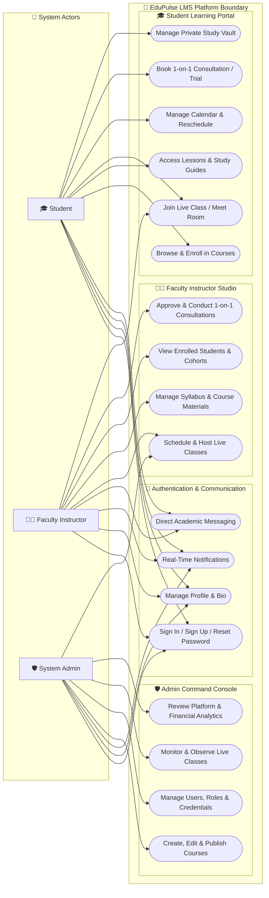
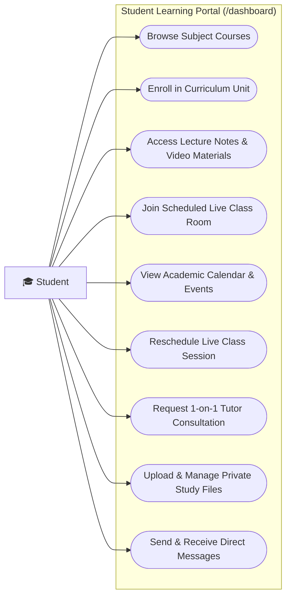
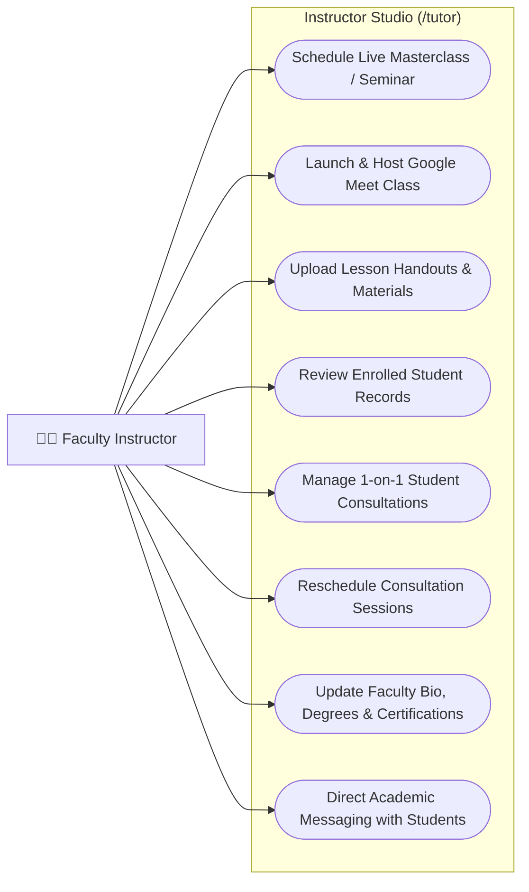
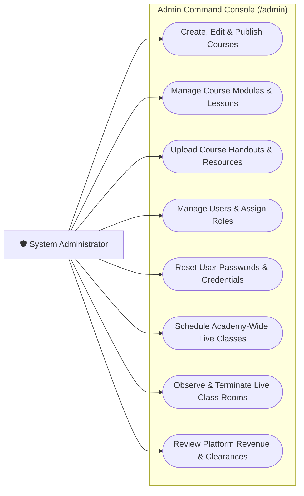

# 📊 EduPulse LMS — Use Case Architecture & Diagrams

This document provides a comprehensive use case specification, UML diagrams, actor definitions, and functional boundaries for the **EduPulse London A/L & O/L Academy Platform**.

---

## 👥 System Actors

| Actor | Description |
| :--- | :--- |
| **🎓 Student** | Enrolls in courses, accesses syllabus materials & past papers, attends live interactive classes, manages study calendar, reschedules sessions, books 1-on-1 consultations, and messages faculty tutors. |
| **👨‍🏫 Faculty Instructor** | Curates course syllabus and lesson materials, schedules and launches live video seminars, reviews enrolled student cohorts, conducts 1-on-1 consultations, and communicates with students. |
| **🛡️ System Administrator** | Manages courses, subjects, pricing, and curriculum publication; administers user accounts, credentials, and roles; monitors live sessions; and audits platform analytics & clearances. |

---

## 🌐 1. High-Level System Use Case Diagram

---

## 🎓 2. Student Portal Use Case Diagram

---

## 👨‍🏫 3. Faculty Instructor Studio Use Case Diagram

---

## 🛡️ 4. Administrator Console Use Case Diagram

---

## 📋 Summary of Functional Modules

### 1. Authentication & Identity
- **Sign In / Sign Up**: Email-based authentication with role-based routing (`/dashboard` for Student, `/tutor` for Instructor, `/admin` for Admin).
- **Password Recovery**: Secure reset workflow with token verification.
- **Direct Messaging**: Real-time communication between students and faculty.
- **Real-Time Sync**: Server-Sent Events (SSE) for instant calendar and notification updates.

### 2. Student Learning Portal (`/dashboard`)
- **Course Enrollment**: Instant enrollment into accredited Pearson Edexcel and Cambridge units.
- **Study Materials**: Access to course modules, lesson videos, and downloadable handouts.
- **Live Class Participation**: Direct Google Meet room integration with live status indicators.
- **Self-Service Rescheduling**: Interactive reschedule modal for class sessions.
- **Private File Vault**: Cloud storage for personal homework and study notes.

### 3. Faculty Instructor Studio (`/tutor`)
- **Live Class Orchestration**: Schedule live seminars, launch video rooms, and record class durations.
- **Curriculum Management**: Add and manage modules, lessons, and course attachments.
- **Student Roster**: Filter and review enrolled students by course, initiate direct contact, and schedule 1-on-1 consultations.
- **Faculty Profile**: Showcase academic degrees, examiner certifications, and office hours.

### 4. Admin Command Console (`/admin`)
- **Course Administration**: Full CRUD on syllabus courses, level categorization, and pricing.
- **User Governance**: Create and edit student/lecturer/admin accounts and credentials.
- **Live Session Monitoring**: Real-time overview of active classes across all faculties.
- **Financial Analytics**: Automated calculation of platform revenues, instructor honorarium clearances, and enrollment metrics.
