# 📊 EduPulse LMS — Use Case Architecture & Diagram

This document outlines the complete use case model, actors, system boundaries, and role-based operational workflows for the **EduPulse London A/L & O/L Academy Platform**.

---

## 👥 System Actors

1. **🎓 Student**
   - Enrolls in Pearson Edexcel & Cambridge International syllabus units.
   - Attends live classes, views recorded lectures, and downloads lesson handouts.
   - Manages personal calendar, reschedules sessions, and books 1-on-1 consultations.
   - Stores private study notes and communicates with tutors in real time.

2. **👨‍🏫 Faculty Instructor (Tutor)**
   - Curates course modules, lessons, past papers, and study resources.
   - Schedules and hosts live interactive video seminars.
   - Manages enrolled student cohorts and conducts 1-on-1 student consultations.
   - Maintains professional academic bio, degrees, certifications, and office hours.

3. **🛡️ System Administrator (Admin)**
   - Manages platform courses, subjects, pricing, and curriculum publication.
   - Administers user accounts, roles, credentials, and access permissions.
   - Monitors live class sessions across the academy.
   - Audits system metrics, financial honorarium clearances, and enrollment statistics.

---

## 📐 System Use Case Diagram

```mermaid
flowchart TB
    %% Actors
    subgraph Actors [System Actors]
        Student["🎓 Student"]
        Instructor["👨‍🏫 Faculty Instructor"]
        Admin["🛡️ System Admin"]
    end

    %% System Boundary
    subgraph SystemBoundary ["EduPulse LMS Platform Boundary"]
        
        %% Authentication & Profile Module
        subgraph AuthModule ["🔐 Authentication & Core Profile Management"]
            UC_Auth(["Sign In / Sign Up / Password Recovery"])
            UC_Profile(["Manage Academic Profile & Bio"])
            UC_Notif(["Receive Real-Time Notifications"])
            UC_Chat(["Direct Academic Messaging"])
        end

        %% Student Module
        subgraph StudentModule ["🎓 Student Learning & Study Activities"]
            UC_BrowseCourses(["Browse & Enroll in Syllabus Units"])
            UC_ViewMaterials(["Access Study Materials & Lesson Notes"])
            UC_JoinLive(["Join Live Class / Meet Room"])
            UC_Calendar(["Manage Schedule & Reschedule Class"])
            UC_RequestTrial(["Book 1-on-1 Consultation / Trial"])
            UC_PrivateFiles(["Upload & Manage Private Study Files"])
        end

        %% Instructor Module
        subgraph InstructorModule ["👨‍🏫 Faculty Studio Operations"]
            UC_ScheduleClass(["Schedule & Start Live Classes"])
            UC_ManageSyllabus(["Manage Syllabus Modules & Materials"])
            UC_ViewStudents(["View Enrolled Cohorts & Records"])
            UC_HandleTrials(["Review & Conduct 1-on-1 Sessions"])
        end

        %% Admin Module
        subgraph AdminModule ["🛡️ Administrator Command Console"]
            UC_ManageCourses(["Create, Edit & Publish Courses"])
            UC_ManageUsers(["Manage Users, Roles & Credentials"])
            UC_ObserveLive(["Monitor & Terminate Live Sessions"])
            UC_ViewAnalytics(["Review Financial & Platform Analytics"])
        end
    end

    %% Student Relationships
    Student --> UC_Auth
    Student --> UC_Profile
    Student --> UC_Notif
    Student --> UC_Chat
    Student --> UC_BrowseCourses
    Student --> UC_ViewMaterials
    Student --> UC_JoinLive
    Student --> UC_Calendar
    Student --> UC_RequestTrial
    Student --> UC_PrivateFiles

    %% Instructor Relationships
    Instructor --> UC_Auth
    Instructor --> UC_Profile
    Instructor --> UC_Notif
    Instructor --> UC_Chat
    Instructor --> UC_ScheduleClass
    Instructor --> UC_ManageSyllabus
    Instructor --> UC_ViewStudents
    Instructor --> UC_HandleTrials
    Instructor --> UC_JoinLive

    %% Admin Relationships
    Admin --> UC_Auth
    Admin --> UC_Profile
    Admin --> UC_Notif
    Admin --> UC_ManageCourses
    Admin --> UC_ManageUsers
    Admin --> UC_ObserveLive
    Admin --> UC_ViewAnalytics
    Admin --> UC_ScheduleClass
```

---

## 📋 Use Case Descriptions by Module

### 1. Authentication & Security
- **Sign In / Sign Up / Password Recovery**: Email-based authentication with role-based routing (`/dashboard`, `/tutor`, `/admin`).
- **Direct Academic Messaging**: Secure communication between students and faculty instructors.
- **Real-Time Notifications**: Instant synchronization for scheduled events, meeting links, and new messages.

### 2. Student Learning Portal (`/dashboard`)
- **Browse & Enroll**: Search course catalog and enroll in London A/L & O/L subject specifications.
- **Materials Access**: Download study guides, video lessons, lecture handouts, and past exam packs.
- **Live Class Participation**: One-click join to Google Meet rooms with automated scheduling indicators.
- **Calendar & Rescheduling**: Synchronized calendar with date filters and student session reschedule workflows.
- **Private Vault**: Secure upload for personal study notes, documents, and past paper answers.

### 3. Faculty Instructor Studio (`/tutor`)
- **Live Class Orchestration**: Schedule live seminars, launch Google Meet rooms, and record class durations.
- **Curriculum Management**: Add and manage modules, lessons, and course attachments.
- **Student Roster**: Filter and review enrolled students by course, initiate direct contact, and schedule 1-on-1 consultations.
- **Faculty Profile**: Showcase academic degrees, exam board examiner certifications, and office hours.

### 4. Admin Command Console (`/admin`)
- **Course Administration**: Full CRUD on syllabus courses, level categorization, and pricing.
- **User Governance**: Create and edit student/lecturer/admin accounts and reset passwords.
- **Live Session Monitoring**: Real-time overview of active classes across all faculties.
- **Financial Analytics**: Automated calculation of platform revenues, instructor honorarium clearances, and enrollment metrics.
